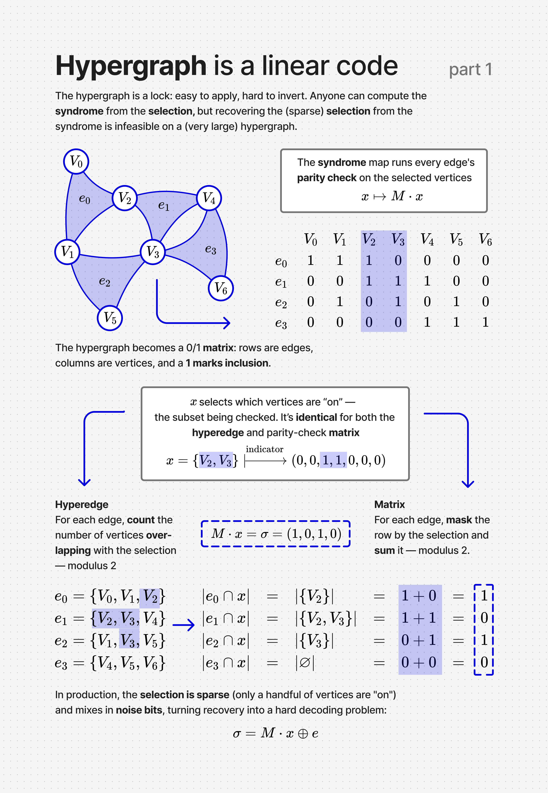
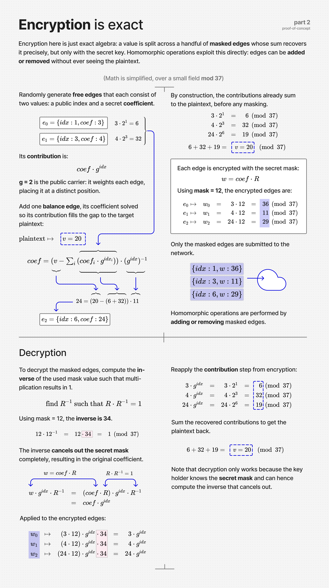
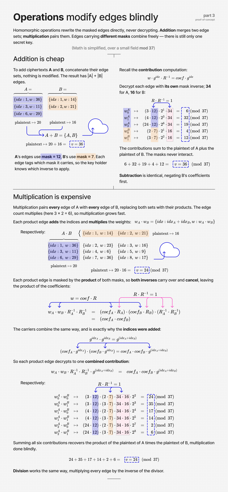

# octra-hfhe-lean

A [Lean 4](https://lean-lang.org) + [Mathlib](https://github.com/leanprover-community/mathlib4) formalization of the **Octra HFHE** scheme, which is an exact homomorphic encryption scheme over a finite field 𝔽ₚ (`p = 2^127-1`, the Mersenne prime). Unlike LWE/BGV‑style FHE, **there is no decryption noise**: decryption is an identity over 𝔽ₚ, and the scheme's "noise" tuples cancel exactly. Consequently there is no noise budget that correctness depends on: the only quantity that grows under evaluation is ciphertext size (edge count).

**=>** Codebase [OVERVIEW](OVERVIEW.md)

> **Note**: this repository is heavily work in progress, and an **independent** study formalization. Not official associated with Octra. Correctness is the focus; the hardness assumptions are taken as given.

> **Note**: this work is based on the public [octra-labs/pvac_hfhe_cpp](https://github.com/octra-labs/pvac_hfhe_cpp) repository at commit `08f345f` (Jun 13 2026).

## Build

```bash
lake exe cache get    # fetch Mathlib's prebuilt oleans
lake build
```

The Lean toolchain is pinned in `lean-toolchain`.

## Infographs

### Hypergraph

A hypergraph is just a linear code, from which masks used for encryption are generated.



### Encryption

Encryption masks plaintext across edges, where the masks cancel exactly under decryption.



### Operations

Homomorphic operations act on the edges directly, growing ciphertext size (edge count).


